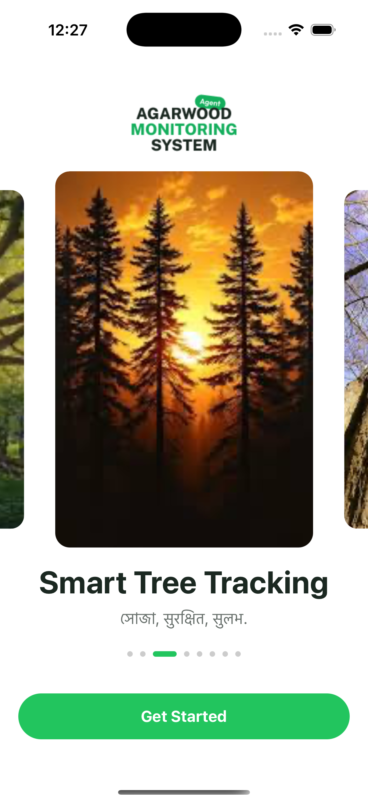
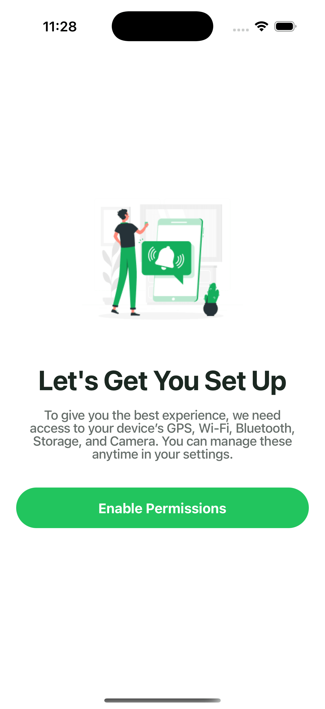

<p align="center">
  <h1 align="center">OutfitCraft</h1>  
</p>

## Introduction

📱 Land Ownership App
This is a React Native mobile application designed to manage and document land ownership details. Users can register land plots, upload ownership and revenue documents, mark GPS locations, and track the number of trees on their land.

The app guides users through a clean onboarding process — including language selection, permission setup, OTP verification, and profile registration with support for multiple landowners.

✨ Key Features
🌐 Multi-language support (Assamese, Hindi, English)

🔐 OTP-based phone number verification

📍 Auto GPS location detection for land

📤 Upload ownership and revenue documents

🌲 Track number of trees for each land plot

👥 Support for Main, Second & Third Owner profiles

🗃️ MMKV local storage for offline persistence

📚 Clean and modern UI with easy navigation

---

## :camera_flash: Screenshots

<div align="center" style="margin:auto;width:100%;display:flex;justify-content:center;align-items:center;flex-wrap:wrap;">





</div>

<br>
<br>

## Development

Make Sure you have [React Native development environment setup](https://reactnative.dev/docs/environment-setup)

```bash
# Install dependencies
yarn install
or
npm install
```

```bash
# Run android
npm run android
or
yarn android
```

```bash
# Run ios
npm run ios
or
yarn ios
```
